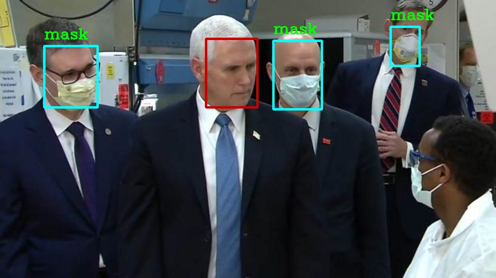
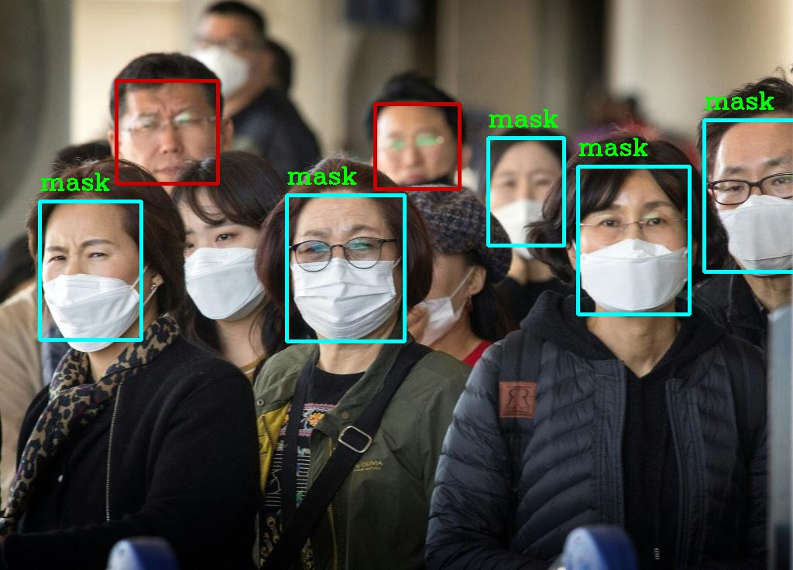

# Face-Mask-Detection

# Require Package Installation 
This project is written by Python 3.For install require_package,Open a terminal 

Go to the Face-Mask-Detection folder and Run the command, sudo pip3 install -r require_package.txt 

Note,You can modify of the package version from a require_package file but this project is worked with this package of version.

# Usage 

Open a terminal,

git clone https://github.com/Myat-Min-Khant/Face-Mask-Detection.git

    cd Face-Mask-Detection/

    sudo chmod +x video_image.py live_webcam.py 

if you are using for image and video, check help command.

    sudo python3 video_image.py --help

    usage: video_image.py [-h] [-i INPUT] [-s SAVE] [-v VIDEO] -c [CONFIDENCE]

    optional arguments:
    
     -h, --help            show this help message and exit
     
     -i INPUT, --input INPUT
                        path of input image
                        
    -s SAVE, --save SAVE  path of save image or video
    
    -v VIDEO, --video VIDEO
                        path of input video
                        
    -c [CONFIDENCE], --confidence [CONFIDENCE]
                        Confidence point of face detection(default = 0.5)
                      
You will see What the arguments are!

for image example usage,

    sudo python3 video_image.py -i "path of input your image" -c
    
    (or)
     
  save image,
  
    sudo python3 video_image.py -i "path of your input image" -s "path of ouput your image" -c 
 
And then for video example usage  is same too,

  for example,
  
    sudo python3 video_image.py -v "path of  input your video file " -c
   
          (or)
          
   save video,
   
    sudo python3 video_image.py -v "path of your input video file" -s "path of output your video file" -c 
   

If you are using for webcam, 

Run The Command, sudo python3 live_webcam.py --help 

Simply Run The Command, 
 
    sudo python3 live_webcam.py  -c
 
        (or) 
        
 save live_webcam frame,
 
    sudo python3 live_webcam.py -s "path of output  your frame(extension with mp4 or avi)" -c 
 
 
 Note,"-c" confidence is the face detection of possible point rectangle.By default, -c is 0.5.However,you can adjustable for this point like 0.169 or 0.4.For example, -c 0.169 or 0.4 and anyother you can play around for this confidence value.If you are interesting to confidence of face detection! Check Out  this https://www.researchgate.net/publication/3845479_Comparison_of_confidence_measures_for_face_recognition paper.

 
   
   
   

  

 

